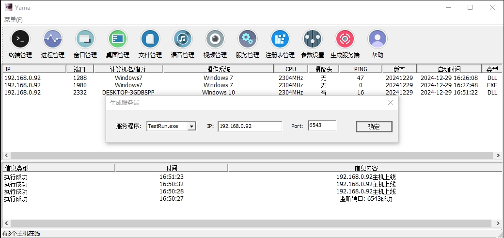
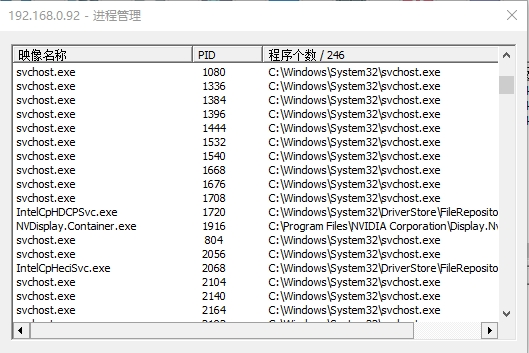
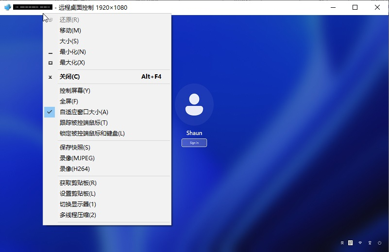
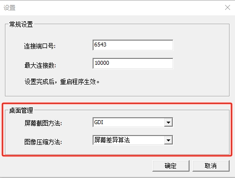
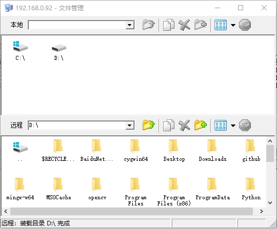
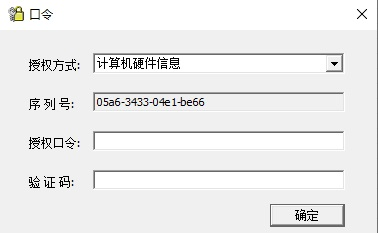
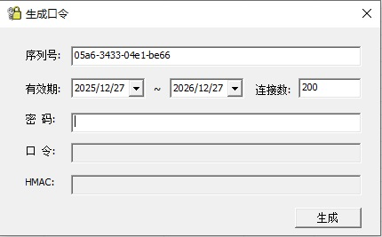
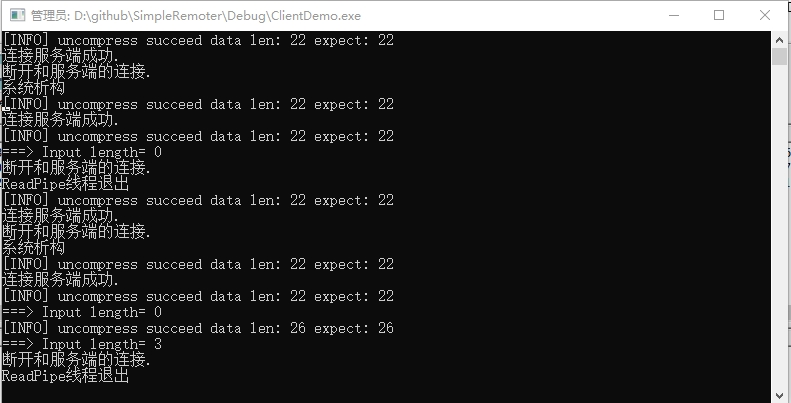
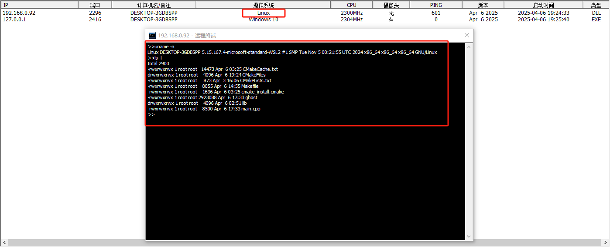

# 🌐 Language | 语言

**[🇺🇸 English](./ReadMe_EN.md) | [🇨🇳 中文](./ReadMe.md)**

---
# 📚 Table of Contents

- [1. Project Overview](#1-project-overview)
- [2. Legal Disclaimer](#2-legal-disclaimer)
- [3. System Architecture](#3-system-architecture)
  - [3.1 Master Controller](#31-master-controller)
  - [3.2 Controlled Client](#32-controlled-client)
  - [3.3 Linux Client](#33-linux-client)
- [4. Deployment Methods](#4-deployment-methods)
  - [4.1 Intranet Deployment](#41-intranet-deployment)
  - [4.2 Internet Deployment](#42-internet-deployment)
- [5. Changelog](#5-changelog)
- [6. Related Projects](#6-related-projects)
- [7. Feedback & Communication](#7-feedback--communication)

---

# 1. Project Overview

**Original Source:** [zibility](https://github.com/zibility/Remote)

**Feature Summary:**  
A remote control system based on gh0st, supporting terminal management, process management, window management, desktop control, file transfer, audio/video streaming, service control, registry viewing, keylogging, SOCKS proxy, virtual desktop, code execution, and more.

If you are passionate about researching control programs and find this project useful, you're welcome to star, fork, watch the repository, submit issues, or contribute via pull requests. The author will address issues depending on spare time availability.

*This program is for educational and technical research purposes only. Users are fully responsible for any consequences arising from its usage.*

**Initial Release Date:** January 1, 2019

# 2. Legal Disclaimer

This project is a research-oriented implementation of remote control technology and is intended solely for legal and educational use.  
**Strictly prohibited**: any illegal access, control, or monitoring of others' devices.

This software is provided "as is" without any warranties. Use of this software is at your own risk.  
We are not liable for any illegal or malicious use of this software.  
Users must comply with applicable laws and use the software responsibly.  
The developer assumes no responsibility for any damages caused by use of this software.

# 3. System Architecture

Since version v1.1.1, the system adopts a two-tier architecture:
- (1) A superuser distributes and manages multiple master controllers.
- (2) Each master controller manages its own set of controlled clients.

**Key characteristics of this architecture:**
- Superusers can control any client in the system via the subordinate masters as relays.
- Cross-communication between hosts managed by different masters is disallowed—each master can only control its own clients.
- Superuser authorization is required to manage master controllers.

**Important: Unauthorized control of other users' devices is strictly prohibited.**

## 3.1 Master Controller

The master controller executable is **YAMA.exe**. It serves as the Server side, using IOCP for communication, and supports tens of thousands of clients online concurrently.

Thanks to the layered architecture, the supported number of hosts increases exponentially.  
For example, if one superuser manages 10 masters, and each master handles 10,000 clients, the system can control up to 100,000 clients.

All features are available and stable in the UI. Some operations require the client to run with administrator privileges.

The main UI displays all connected clients.  
You can select a host to perform remote actions such as renaming, proxy mapping, or executing commands.

The terminal module allows you to execute remote commands in a command-line interface.  
A [minimal Linux version](./linux/main.cpp) is also available for research and development.

Displays the running processes on the controlled host. You can start or stop normal processes (not system-level ones).

Displays and allows manipulation of open windows on the controlled machine, including hide/show functionality.

  

Desktop management provides a full remote desktop experience. You can configure the capture method (GDI, DXGI, or VIRTUAL) and compression options (grayscale, screen diff, H264).  
The **VIRTUAL** option allows headless remote control for improved performance.  
It also supports reporting active windows and detecting specific applications.

File management allows file transfer between your machine and the client device.

Enables audio monitoring and voice transmission, provided the target machine has audio devices.

Opens the client’s webcam. Camera detection is enabled by default and indicated in the host list.

Allows viewing and managing services on the target machine (start/stop), subject to permissions.

Enables viewing (read-only) the client’s registry.

**About Licensing:**  
Since version v1.0.8, using the master controller requires authorization. New builds have a 14-day trial, after which a "serial number" is needed to request an unlock code.  
To remove this logic, refer to the `OnOnlineBuildClient` function and recompile the software. See:  
[#91](https://github.com/yuanyuanxiang/SimpleRemoter/issues/91)

The unlock code includes a validity period and is tied to the machine ID. The system checks for system time tampering. Generating a valid unlock code requires a password.

  

As of v1.1.1, the precompiled version is no longer authorized. All users must build the software themselves.  
Otherwise, after 10 minutes of use, a dialog will prompt for an unlock code.  
This prevents misuse by non-technical users.  
If you only want to try out the program, version v1.0.7 or earlier is sufficient as core functionality is unchanged.  
If you're interested in the technology, you're encouraged to compile it yourself.

## 3.2 Controlled Client

The controlled client is the **Client-side** application, available in two formats:
1. A single executable: `ghost.exe`
2. A launcher + DLL: `TestRun.exe` with `ServerDll.dll`

The first form is self-contained.  
Since [v1.0.8](https://github.com/yuanyuanxiang/SimpleRemoter/releases/tag/v1.0.0.8), `TestRun.exe` loads the DLL into memory, allowing dynamic updates from the master.

## 3.3 Linux Client

A Linux version is included in [v1.0.8](./Releases/v1.0.8/ghost), currently only supporting terminal access.

Compile the client on a Linux system. Then, in the master build dialog, select the compiled binary and set the desired connection address to generate a valid Linux client.

---

# 4. Deployment Methods

## 4.1 Intranet Deployment

This means the master and clients are within the same local network. The client can directly reach the master’s IP and port.  
This is the simplest form—just enter the master’s local IP and port when building the client.

## 4.2 Internet Deployment

In this case, the master and clients are on different networks, and the master lacks a public IP.  
Clients cannot directly connect. To bridge this, a **"middleman"** is required to forward traffic.

One method is using [Peanuthull](./使用花生壳.txt), but here we focus on a second method, which works similarly:

> *Client → VPS → Master*

A **VPS (Virtual Private Server)** is used as a relay to control remote clients.  
A physical server can also be used, but VPS is more cost-effective.  
Usually, you need to rent one and set up port forwarding using [FRP (Fast Reverse Proxy)](https://github.com/fatedier/frp).

During client generation, use the VPS IP (or domain, if available).  
The FRP server runs on the VPS, while the FRP client runs on your local machine.  
Once a client connects to the VPS, the relay will forward traffic to your local machine, completing the control loop.

---

# 5. Changelog

For changes before 2025, see: [history](./history.md)

**2025.01.12**  
Fixed two potential remote desktop issues (#28, #29).  
Added sorting for the controller’s list windows (#26, #27), making it easier to locate windows, services, or processes.

Released version **v1.0.6**, noted for high stability.  
This version does **not** support older Windows XP systems  
(note: VS2019 and later have dropped support for XP toolchains; use older Visual Studio versions if needed).  
Download the latest release from GitHub or clone the repo.  
If antivirus software flags it as a virus, this is expected due to the nature of the software — feel free to compile it yourself for verification.

**2025.02.01**  
Inspired by [Gh0st](https://github.com/yuanyuanxiang/Gh0st/pull/2), added **keylogging** support, implemented by copying four core files:

*KeyboardManager.h、KeyboardManager.cpp、KeyBoardDlg.h、KeyBoardDlg.cpp*

**2025.04.05**

Release v1.0.7, mainly fix or add new feature:
 
- Update third-party libraries and switch zlib to zstd, old version v1.0.6 is compatible;
- Support compile with Win64;
- Fix buges and make the program more stable;
- Improve remote control efficiency and support more bitmap compressing method;
- Some code reorganization.

**2025.04.12**

Since v1.0.7 released in April 5:

- Improvement: Make sure that the input command is always at the end of `Shelldlg`, and build a **simple Linux client**;
- Fix bugs: #62, #74, #75 ;
- Change the flag 0x1234567 to a more readable string; and improve building service and allow chosing other files to build;
- Showing the user's activities and monitoring specified software;
- Clean up global variables and make it easy to create multiple clients in one program, which is useful for testing the master's capacity;
- Implement loading DLL in memory, make it easy to update client program;

**2025.04.21**

Release v1.0.8:

- Support to share online host with other masters;
- Implement service-generated authorization capability, and add a serial number generation menu;
- Add `HPSocket` libraries which may be used in the future, and add static ffmpeg libraries to build Win64 master;
- Implement a memory DLL runner: the `TestRun` program request DLL from master and execute in memory.

**2025.04.30**

Release v1.0.9：

- Update client building feature / All in one; The master will only accept the clients built by itself.
- Improve authorization feature.

**2025.06.01**

Release v1.1.0:

* fix: IOCPClient clear buffer when disconnect
* Implement SOCKS proxy feature
* Add menus and modify list style, add log
* feature: Add a C program to execute shell code
* feature: Encrypt for server address
* feat: Support virtual remote desktop monitoring
* feature: Add command to execute DLL

---

# 6. Related Projects

- [HoldingHands](https://github.com/yuanyuanxiang/HoldingHands): A remote control program with a fully English interface and a different architectural design.
- [BGW RAT](https://github.com/yuanyuanxiang/BGW_RAT): A fully featured remote access tool, also known as Big Grey Wolf 9.5.
- [Gh0st](https://github.com/yuanyuanxiang/Gh0st): Another remote controller based on the original Gh0st RAT.

---

# 7. Feedback & Communication

QQ: 962914132

Contact: [Telegram](https://t.me/doge_grandfather), [Email](mailto:yuanyuanxiang163@gmail.com), [LinkedIn](https://www.linkedin.com/in/wishyuanqi)

Issue Reporting: [Issues](https://github.com/yuanyuanxiang/SimpleRemoter/issues)

Contributions welcome: [Merge requests](https://github.com/yuanyuanxiang/SimpleRemoter/pulls)

## Sponsorship

This project stems from technical exploration and personal interest. Updates are made on a non-regular basis, depending on available spare time.  
**If you find this project useful, please consider supporting it via the sponsor icon.**  
If you'd prefer to sponsor using other methods (e.g., WeChat, Alipay or PayPal), please click  
[here](https://github.com/yuanyuanxiang/yuanyuanxiang/blob/main/images/QR_Codes.jpg).
