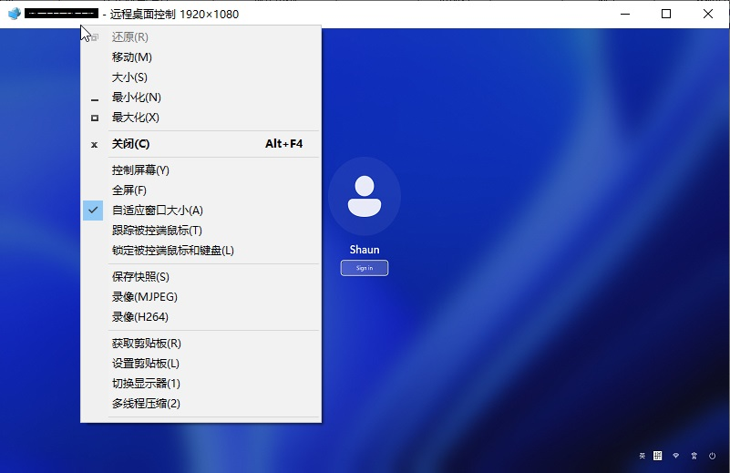
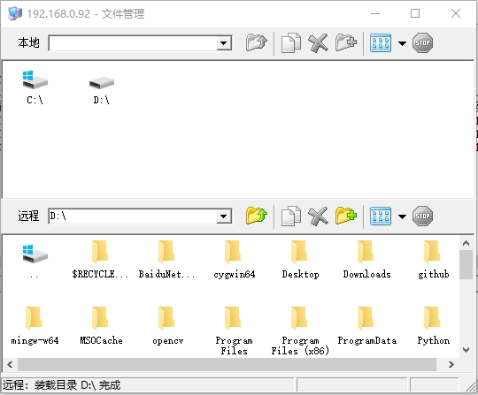
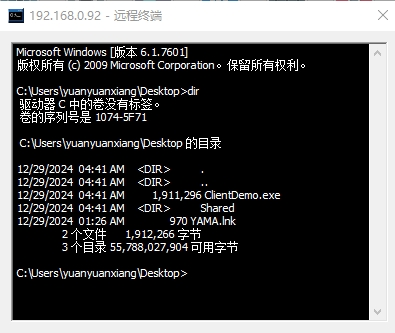
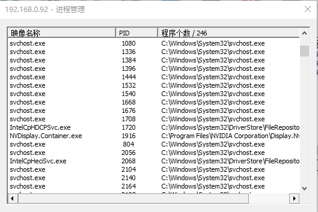
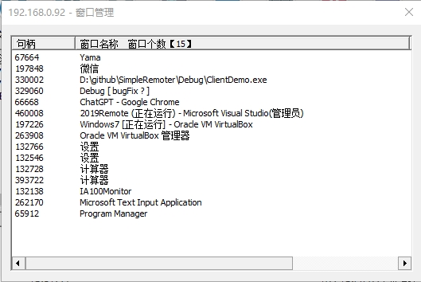
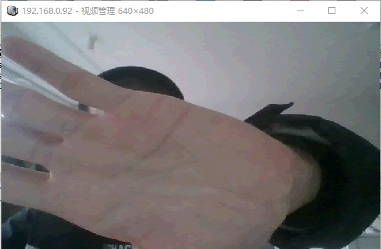
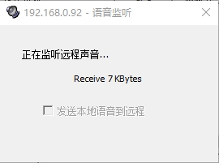
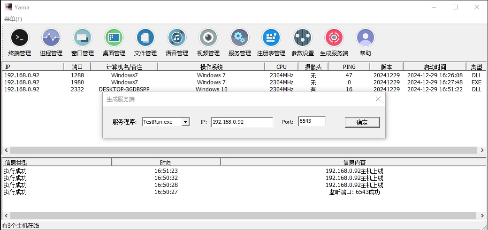
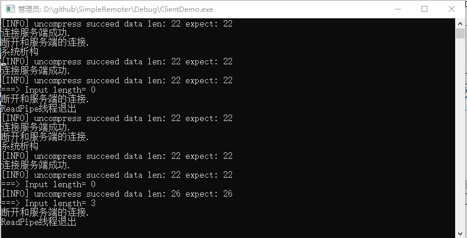

# SimpleRemoter

**[简体中文](./ReadMe.md) | [繁體中文](./ReadMe_TW.md) | [English](./ReadMe_EN.md)**

<p align="center">
  <a href="https://github.com/yuanyuanxiang/SimpleRemoter/stargazers">
    
  </a>
  <a href="https://github.com/yuanyuanxiang/SimpleRemoter/network/members">
    
  </a>
  <a href="https://github.com/yuanyuanxiang/SimpleRemoter/releases">
    
  </a>
  
  
  
  
</p>

<p align="center">
  <a href="https://github.com/yuanyuanxiang/SimpleRemoter/releases/latest">
    
  </a>
</p>

---

> [!WARNING]
> **重要法律聲明**
>
> 本軟件**僅供教育目的及授權使用場景**，包括：
> - 在您的組織內進行遠端 IT 管理
> - 經授權的滲透測試和安全研究
> - 個人設備管理和技術學習
>
> **未經授權存取電腦系統屬違法行為。** 使用者須對遵守所有適用法律承擔全部責任。開發者對任何濫用行為概不負責。

---

## 目錄

- [專案簡介](#專案簡介)
- [免責聲明](#免責聲明)
- [功能特性](#功能特性)
- [技術亮點](#技術亮點)
- [系統架構](#系統架構)
- [快速開始](#快速開始)
- [用戶端支援](#用戶端支援)
- [更新日誌](#更新日誌)
- [相關專案](#相關專案)
- [聯絡方式](#聯絡方式)

---

## 專案簡介

**SimpleRemoter** 是一個功能完整的遠端控制解決方案，基於經典的 Gh0st 框架重構，採用現代 C++17 開發。專案始於 2019 年，經過持續迭代已發展為支援 **Windows + Linux** 雙平台的企業級遠端管理工具。

### 核心能力

| 類別 | 功能 |
|------|------|
| **遠端桌面** | 即時螢幕控制、多顯示器支援、H.264 編碼、自適應品質 |
| **檔案管理** | 雙向傳輸、斷點續傳、C2C 傳輸、SHA-256 校驗 |
| **終端管理** | 互動式 Shell、ConPTY/PTY 支援、現代 Web 終端 |
| **系統管理** | 程序/服務/視窗管理、登錄檔瀏覽、工作階段控制 |
| **媒體擷取** | 網路攝影機監控、音訊監聽、鍵盤記錄 |
| **網路功能** | SOCKS 代理、FRP 穿透、埠映射 |

### 適用場景

- **企業 IT 運維**：批次管理內網設備，遠端故障排查
- **遠端辦公**：安全存取辦公電腦，檔案同步傳輸
- **安全研究**：滲透測試、紅隊演練、安全稽核
- **技術學習**：網路程式設計、IOCP 模型、加密傳輸實踐

**原始來源：** [zibility/Remote](https://github.com/zibility/Remote) | **起始日期：** 2019.1.1

[](https://star-history.com/#yuanyuanxiang/SimpleRemoter&Date)

---

## 免責聲明

**請在使用本軟件前仔細閱讀以下聲明：**

1. **合法用途**：本專案僅供合法的技術研究、學習交流和授權的遠端管理使用。嚴禁將本軟件用於未經授權存取他人電腦系統、竊取資料、監控他人隱私等任何違法行為。

2. **使用者責任**：使用者必須遵守所在國家/地區的法律法規。因使用本軟件而產生的任何法律責任，由使用者自行承擔。

3. **無擔保聲明**：本軟件按「現狀」提供，不附帶任何明示或暗示的擔保，包括但不限於適銷性、特定用途適用性的擔保。

4. **免責條款**：開發者不對因使用、誤用或無法使用本軟件而造成的任何直接、間接、偶然、特殊或後果性損害承擔責任。

5. **版權聲明**：本專案採用 MIT 協議開源，允許自由使用、修改和分發，但必須保留原始版權聲明。

**繼續使用本軟件即表示您已閱讀、理解並同意上述所有條款。**

---

## 功能特性

### 遠端桌面



- **多種截圖方式**：GDI（相容性強）、DXGI（高效能）、虛擬桌面（背景執行）
- **智慧壓縮演算法**：
  - DIFF 差分演算法 - SSE2 優化，僅傳輸變化區域
  - RGB565 演算法 - 節省 50% 頻寬
  - H.264 編碼 - 視訊級壓縮，適合高幀率場景
  - 灰階模式 - 極低頻寬消耗
- **自適應品質**：根據網路 RTT 自動調整幀率（5-30 FPS）、解析度和壓縮演算法
- **多顯示器**：支援多螢幕切換和多螢幕牆顯示
- **隱私螢幕**：被控端螢幕可隱藏，支援鎖定畫面狀態下控制
- **檔案拖放**：Ctrl+C/V 跨設備複製貼上檔案

### 檔案管理



- **V2 傳輸協定**：全新設計，支援大檔案（>4GB）
- **斷點續傳**：網路中斷後自動恢復，狀態持久化
- **C2C 傳輸**：用戶端之間直接傳輸，無需經過主控
- **完整性校驗**：SHA-256 雜湊驗證，確保檔案完整
- **批次操作**：支援檔案搜尋、壓縮、批次傳輸

### 終端管理



- **互動式 Shell**：完整的命令列體驗，支援 Tab 補全
- **ConPTY 技術**：Windows 10+ 原生虛擬終端支援
- **現代 Web 終端**：基於 WebView2 + xterm.js（v1.2.7+）
- **終端尺寸調整**：自適應視窗大小

### 程序與視窗管理

| 程序管理 | 視窗管理 |
|---------|---------|
|  |  |

- **程序管理**：檢視程序清單、CPU/記憶體佔用、啟動/終止程序
- **程式碼注入**：向目標程序注入 DLL（需系統管理員權限）
- **視窗控制**：最大化/最小化/隱藏/關閉視窗

### 媒體功能

| 視訊管理 | 音訊管理 |
|---------|---------|
|  |  |

- **網路攝影機監控**：即時視訊串流，支援解析度調整
- **音訊監聽**：遠端聲音擷取，支援雙向語音
- **鍵盤記錄**：線上/離線記錄模式

### 其他功能

- **服務管理**：檢視和控制 Windows 服務
- **登錄檔瀏覽**：唯讀方式瀏覽登錄檔內容
- **工作階段控制**：遠端登出/關機/重新啟動
- **SOCKS 代理**：透過用戶端建立代理通道
- **FRP 穿透**：內建 FRP 支援，輕鬆穿透內網
- **程式碼執行**：遠端執行 DLL，支援熱更新

---

## 技術亮點

### 高效能網路架構

```
┌─────────────────────────────────────────────────────────┐
│                    IOCP 通訊模型                          │
├─────────────────────────────────────────────────────────┤
│  • I/O 完成埠：Windows 最高效的非同步 I/O 模型            │
│  • 單主控支援 10,000+ 並行連線                            │
│  • 支援 TCP / UDP / KCP 三種傳輸協定                      │
│  • 自動分塊處理大資料封包（最大 128KB 傳送緩衝）           │
└─────────────────────────────────────────────────────────┘
```

### 自適應品質控制

基於 RTT（Round-Trip Time）的智慧品質調整系統：

| RTT 延遲 | 品質等級 | 幀率 | 解析度 | 壓縮演算法 | 適用場景 |
|---------|---------|------|--------|-----------|---------|
| < 30ms | Ultra | 25 FPS | 原始 | DIFF | 區域網路辦公 |
| 30-80ms | High | 20 FPS | 原始 | RGB565 | 一般辦公 |
| 80-150ms | Good | 20 FPS | ≤1080p | H.264 | 跨網/視訊 |
| 150-250ms | Medium | 15 FPS | ≤900p | H.264 | 跨網辦公 |
| 250-400ms | Low | 12 FPS | ≤720p | H.264 | 較差網路 |
| > 400ms | Minimal | 8 FPS | ≤540p | H.264 | 極差網路 |

- **零額外開銷**：複用心跳封包計算 RTT
- **快速降級**：2 次偵測即觸發，回應網路波動
- **謹慎升級**：5 次穩定後才提升品質
- **冷卻機制**：防止頻繁切換

### V2 檔案傳輸協定

```cpp
// 77 位元組協定標頭 + 檔案名稱 + 資料載荷
struct FileChunkPacketV2 {
    uint8_t   cmd;            // COMMAND_SEND_FILE_V2 = 85
    uint64_t  transferID;     // 傳輸工作階段 ID
    uint64_t  srcClientID;    // 來源用戶端 ID (0=主控端)
    uint64_t  dstClientID;    // 目標用戶端 ID (0=主控端, C2C)
    uint32_t  fileIndex;      // 檔案編號 (0-based)
    uint32_t  totalFiles;     // 總檔案數
    uint64_t  fileSize;       // 檔案大小（支援 >4GB）
    uint64_t  offset;         // 目前區塊位移
    uint64_t  dataLength;     // 本區塊資料長度
    uint64_t  nameLength;     // 檔案名稱長度
    uint16_t  flags;          // 標誌位元 (FFV2_LAST_CHUNK 等)
    uint16_t  checksum;       // CRC16 校驗（可選）
    uint8_t   reserved[8];    // 預留擴充
    // char filename[nameLength];  // UTF-8 相對路徑
    // uint8_t data[dataLength];   // 檔案資料
};
```

**特性**：
- 大檔案支援（uint64_t 突破 4GB 限制）
- 斷點續傳（狀態持久化到 `%TEMP%\FileTransfer\`）
- SHA-256 完整性校驗
- C2C 直傳（用戶端到用戶端）
- V1/V2 協定相容

### 螢幕傳輸優化

- **SSE2 指令集**：像素差分計算硬體加速
- **多執行緒並行**：執行緒池分塊處理螢幕資料
- **捲動偵測**：識別捲動場景，減少 50-80% 頻寬
- **H.264 編碼**：基於 x264，GOP 控制，視訊級壓縮

### 安全機制

| 層級 | 措施 |
|------|------|
| **傳輸加密** | AES-256 資料加密，可設定 IV |
| **身分驗證** | 簽章驗證 + HMAC 認證 |
| **授權控制** | 序號綁定（IP/網域），多級授權 |
| **檔案校驗** | SHA-256 完整性驗證 |
| **工作階段隔離** | Session 0 獨立處理 |

### 相依套件

| 套件 | 版本 | 用途 |
|------|------|------|
| zlib | 1.3.1 | 通用壓縮 |
| zstd | 1.5.7 | 高速壓縮 |
| x264 | 0.164 | H.264 編碼 |
| libyuv | 190 | YUV 轉換 |
| HPSocket | 6.0.3 | 網路 I/O |
| jsoncpp | 1.9.6 | JSON 解析 |

---

## 系統架構


### 兩層控制架構（v1.1.1+）

```
超級使用者
    │
    ├── Master 1 ──> 用戶端群組 A（最多 10,000+）
    ├── Master 2 ──> 用戶端群組 B
    └── Master 3 ──> 用戶端群組 C
```

**設計優勢**：
- **層級控制**：超級使用者可管理任意主控程式
- **隔離機制**：不同主控管理的用戶端相互隔離
- **水平擴充**：10 個 Master × 10,000 用戶端 = 100,000 設備

### 主控程式（Server）

主控程式 **YAMA.exe** 提供圖形化管理介面：



- 基於 IOCP 的高效能伺服器
- 用戶端分組管理
- 即時狀態監控（RTT、地理位置、活動視窗）
- 一鍵產生用戶端

### 受控程式（Client）



**執行形式**：

| 類型 | 說明 |
|------|------|
| `ghost.exe` | 獨立可執行檔，無外部相依 |
| `TestRun.exe` + `ServerDll.dll` | 分離載入，支援記憶體載入 DLL |
| Windows 服務 | 背景執行，支援鎖定畫面控制 |
| Linux 用戶端 | 跨平台支援（v1.2.5+） |

---

## 快速開始

### 5 分鐘快速體驗

無需編譯，下載即用：

1. **下載發佈版** - 從 [Releases](https://github.com/yuanyuanxiang/SimpleRemoter/releases/latest) 下載最新版本
2. **啟動主控** - 執行 `YAMA.exe`，輸入授權資訊（見下方試用口令）
3. **產生用戶端** - 點擊工具列「產生」按鈕，設定伺服器 IP 和連接埠
4. **部署用戶端** - 將產生的用戶端複製到目標機器並執行
5. **開始控制** - 用戶端上線後，雙擊即可開啟遠端桌面

> [!TIP]
> 首次測試建議在同一台機器上執行主控和用戶端，使用 `127.0.0.1` 作為伺服器位址。

### 編譯要求

- **作業系統**：Windows 10/11 或 Windows Server 2016+
- **開發環境**：Visual Studio 2019 / 2022 / 2026
- **SDK**：Windows 10 SDK (10.0.19041.0+)

### 編譯步驟

```bash
# 1. 複製程式碼（必須使用 git clone，不要下載 zip）
git clone https://github.com/yuanyuanxiang/SimpleRemoter.git

# 2. 開啟方案
#    使用 VS2019+ 開啟 SimpleRemoter.sln

# 3. 選擇組態
#    Release | x86 或 Release | x64

# 4. 編譯
#    建置 -> 建置方案
```

**常見問題**：
- 相依套件衝突：[#269](https://github.com/yuanyuanxiang/SimpleRemoter/issues/269)
- 非中文系統亂碼：[#157](https://github.com/yuanyuanxiang/SimpleRemoter/issues/157)
- 編譯器相容性：[#171](https://github.com/yuanyuanxiang/SimpleRemoter/issues/171)

### 部署方式

#### 內網部署

主控與用戶端在同一區域網路，用戶端直連主控 IP:Port。

#### 外網部署（FRP 穿透）

```
用戶端 ──> VPS (FRP Server) ──> 本機主控 (FRP Client)
```

詳細設定請參考：[反向代理部署說明](./反向代理.md)

### 授權說明

自 v1.2.4 起提供試用口令（2 年有效期，20 並行連線，僅限內網）：

```
授權方式：按電腦 IP 綁定
主控 IP：127.0.0.1
序號：12ca-17b4-9af2-2894
密碼：20260201-20280201-0020-be94-120d-20f9-919a
驗證碼：6015188620429852704
有效期：2026-02-01 至 2028-02-01
```

> [!NOTE]
> **多層授權方案**
>
> SimpleRemoter 採用企業級多層授權架構，支援代理商/開發者獨立運營：
> - **離線驗證**：第一層使用者獲得授權後可完全離線使用
> - **獨立控制**：您的下級使用者只連接到您的伺服器，資料完全由您掌控
> - **自由定制**：支援二次開發，打造您的專屬版本
>
> 📖 **[查看完整授權方案說明](./docs/MultiLayerLicense.md)**

---

## 用戶端支援

### Windows 用戶端

**系統要求**：Windows 7 SP1 及以上

**功能完整性**：✅ 全部功能支援

### Linux 用戶端（v1.2.5+）

**系統要求**：
- 顯示伺服器：X11/Xorg（暫不支援 Wayland）
- 必需套件：libX11
- 建議套件：libXtst（XTest 擴充）、libXss（閒置偵測）

**功能支援**：

| 功能 | 狀態 | 實作 |
|------|------|------|
| 遠端桌面 | ✅ | X11 螢幕擷取，滑鼠/鍵盤控制 |
| 遠端終端 | ✅ | PTY 互動式 Shell |
| 檔案管理 | ✅ | 雙向傳輸，大檔案支援 |
| 程序管理 | ✅ | 程序清單、終止程序 |
| 心跳/RTT | ✅ | RFC 6298 RTT 估算 |
| 常駐程式 | ✅ | 雙 fork 常駐化 |
| 剪貼簿 | ⏳ | 開發中 |
| 工作階段管理 | ⏳ | 開發中 |

**編譯方式**：

```bash
cd linux
cmake .
make
```

---

## 更新日誌

### v1.2.8 (2026.3.11)

**郵件通知 & 遠端音訊**

- 主機上線郵件通知（SMTP 配置、關鍵字匹配、右鍵快捷添加）
- 遠端音訊播放（WASAPI Loopback）+ Opus 壓縮（24:1）
- 多 FRPS 伺服器同時連接支援
- 自訂游標顯示和追蹤
- V2 授權協定（ECDSA 簽名）
- 修復非中文 Windows 系統亂碼問題
- Linux 用戶端螢幕壓縮演算法優化

### v1.2.7 (2026.2.28)

**V2 檔案傳輸協定**

- 支援 C2C（用戶端到用戶端）直接傳輸
- 斷點續傳和大檔案支援（>4GB）
- SHA-256 檔案完整性校驗
- WebView2 + xterm.js 現代終端
- Linux 檔案管理支援
- 主機清單批次更新優化，減少 UI 閃爍

### v1.2.6 (2026.2.16)

**遠端桌面工具列重寫**

- 狀態視窗顯示 RTT、幀率、解析度
- 全螢幕工具列支援 4 個位置和多顯示器
- H.264 頻寬優化
- 授權管理 UI 完善

### v1.2.5 (2026.2.11)

**自適應品質控制 & Linux 用戶端**

- 基於 RTT 的智慧品質調整
- RGB565 演算法（節省 50% 頻寬）
- 捲動偵測優化（節省 50-80% 頻寬）
- Linux 用戶端初版發佈

完整更新歷史請檢視：[history.md](./history.md)

---

## 相關專案

- [HoldingHands](https://github.com/yuanyuanxiang/HoldingHands) - 全英文介面遠端控制
- [BGW RAT](https://github.com/yuanyuanxiang/BGW_RAT) - 大灰狼 9.5
- [Gh0st](https://github.com/yuanyuanxiang/Gh0st) - 經典 Gh0st 實作

---

## 聯絡方式

| 管道 | 連結 |
|------|------|
| **QQ** | 962914132 |
| **Telegram** | [@doge_grandfather](https://t.me/doge_grandfather) |
| **Email** | [yuanyuanxiang163@gmail.com](mailto:yuanyuanxiang163@gmail.com) |
| **LinkedIn** | [wishyuanqi](https://www.linkedin.com/in/wishyuanqi) |
| **Issues** | [問題回報](https://github.com/yuanyuanxiang/SimpleRemoter/issues) |
| **PR** | [貢獻程式碼](https://github.com/yuanyuanxiang/SimpleRemoter/pulls) |

### 贊助支持

本專案源於技術學習與興趣愛好，作者將根據業餘時間不定期更新。如果本專案對您有所幫助，歡迎贊助支持：

[](https://github.com/yuanyuanxiang/yuanyuanxiang/blob/main/images/QR_Codes.jpg)

---

<p align="center">
  <sub>如果您喜歡這個專案，請給它一個 ⭐ Star！</sub>
</p>
